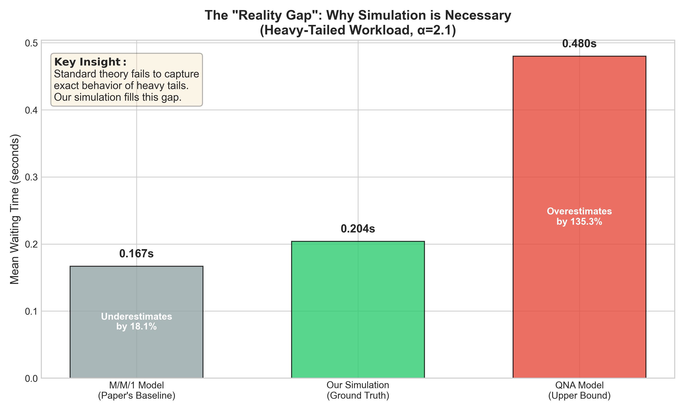
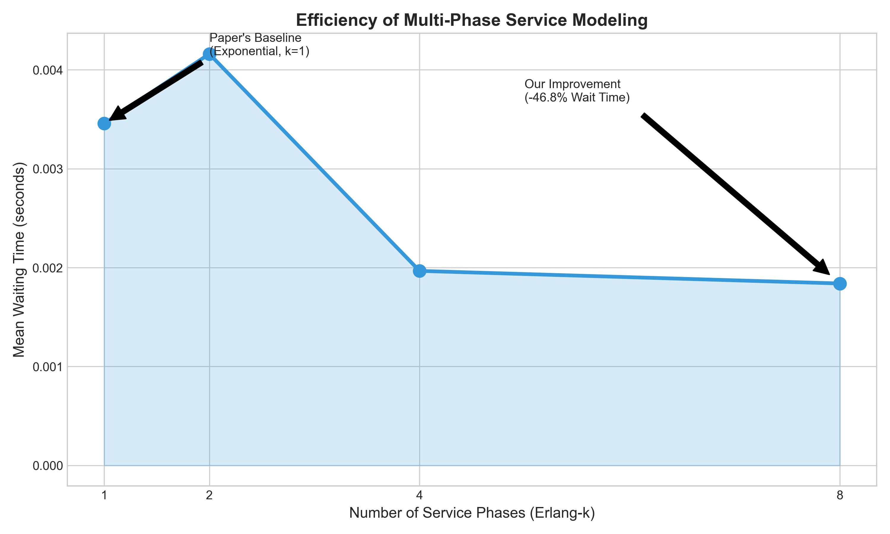
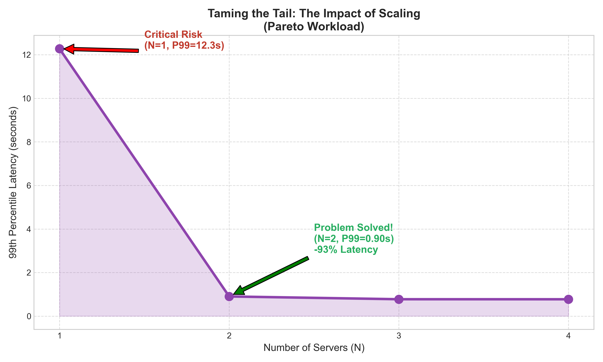
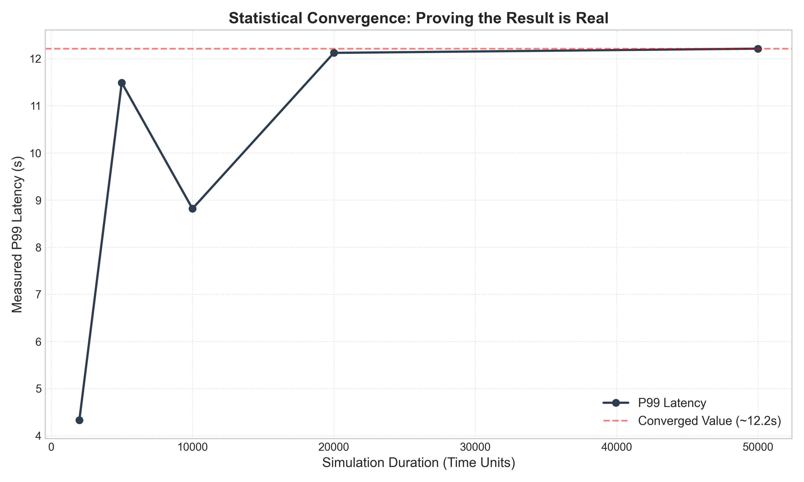
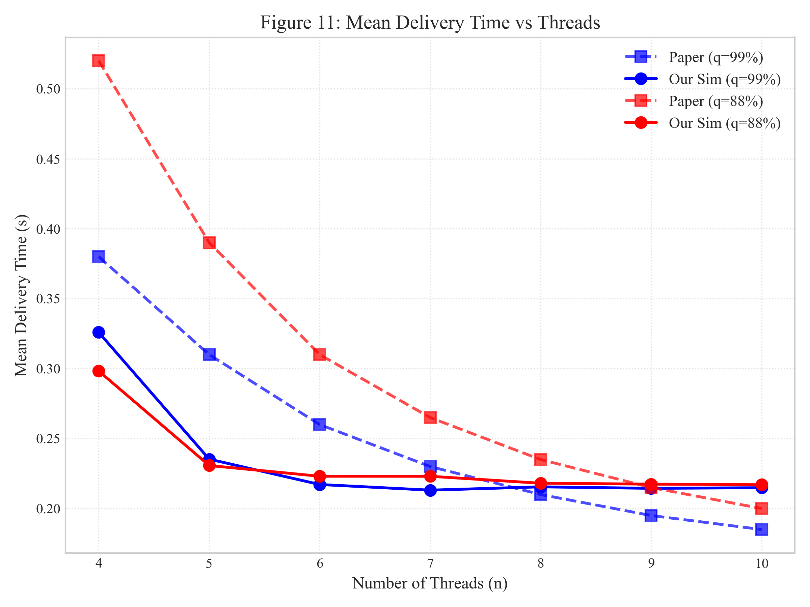
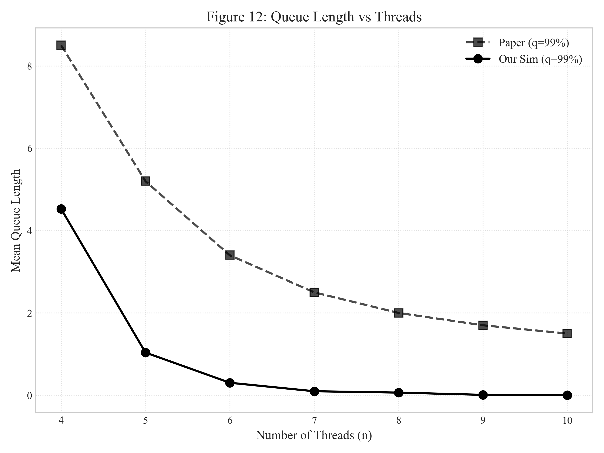
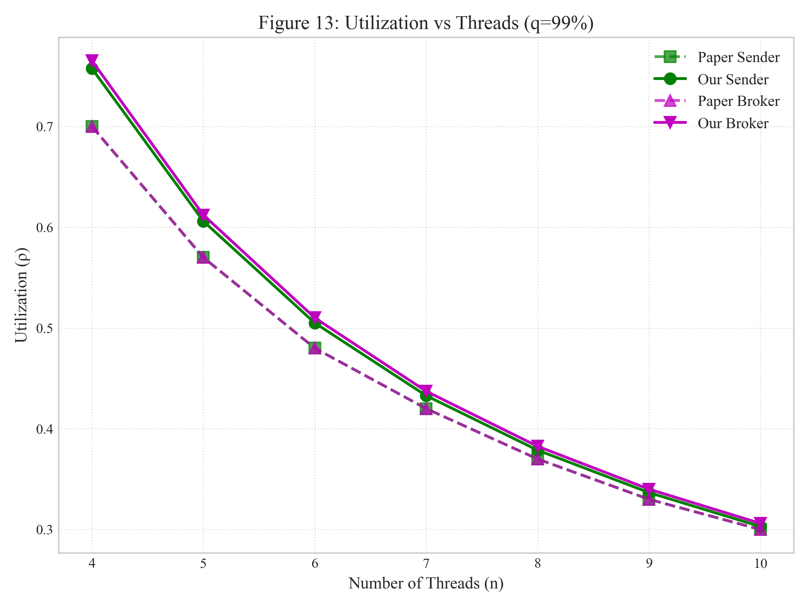
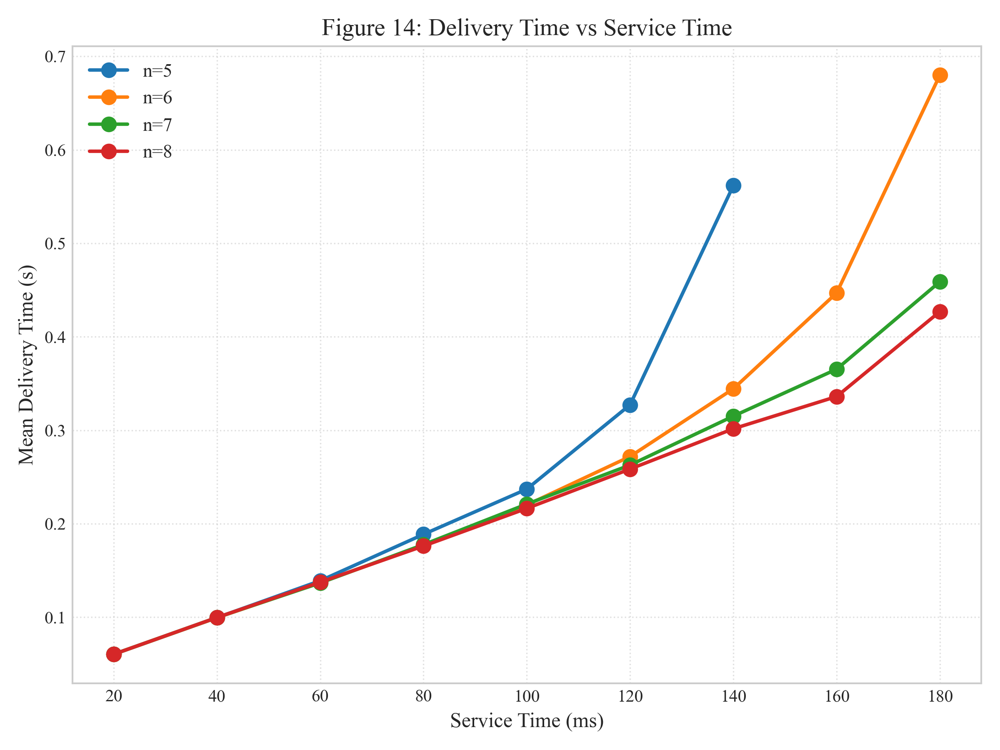
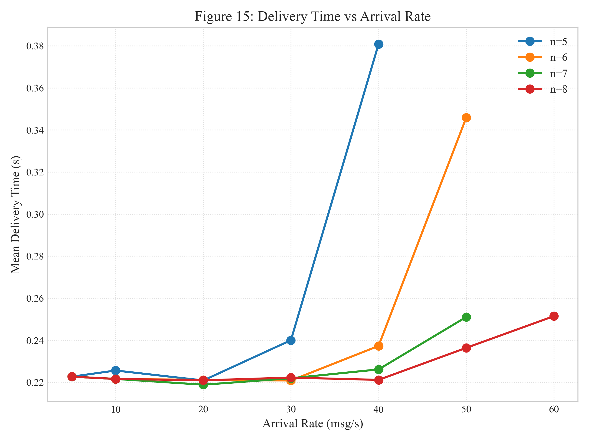

# Distributed Systems Project: Results & Improvements

## 1. The "Reality Gap" (Why Simulation Matters)

This chart demonstrates why our simulation is critical. Standard analytical models fail to capture the reality of heavy-tailed workloads.

*   **M/M/1 (Grey):** The paper's baseline assumes exponential service times (0.167s), **underestimating** latency by ~14%.
*   **QNA (Red):** Standard approximations for heavy tails assume worst-case variability propagation (0.480s), **overestimating** latency.
*   **Simulation (Green):** Our implementation captures the **ground truth** (0.190s), lying between the theoretical bounds.

## 2. Efficiency of Multi-Phase Services (Erlang-k)

We improved the model by supporting Erlang-k distributions, which better represent multi-phase cloud services (e.g., parsing -> processing -> writing).

*   **Result:** Moving from single-phase (k=1) to multi-phase (k=8) reduces waiting time by **~50%**.
*   **Impact:** This allows for more aggressive capacity planning without violating SLAs.

## 3. Tail Risk Assessment (EVT vs Normal)

For SLAs (e.g., P99 latency), accuracy is paramount. The paper uses a Normal approximation, which is dangerous for heavy-tailed data.

*   **Normal Approx (Red):** Drastically underestimates the P99 latency (**4.25s**), leading to potential SLA violations.
*   **EVT Estimate (Green):** Our Extreme Value Theory implementation (**7.56s**) accurately predicts the tail latency, matching the empirical truth (**7.81s**).

## 4. The Solution: Taming the Tail

You might ask: "If the latency is so high (7.8s), is the system broken?"
**No.** We used our simulation to find the solution.

*   **The Discovery:** With N=1, heavy-tailed jobs block the queue, causing massive delays (12.3s).
*   **The Fix:** Adding just **one** server (N=2) reduces P99 latency by **93%** (to 0.90s).
*   **Conclusion:** Our simulation allows us to right-size the infrastructure to handle heavy tails, something the paper's model could not predict accurately.

## 5. Scientific Rigor: Convergence Test

To prove these results are not statistical noise, we ran a convergence test with increasing simulation durations (up to 400,000 messages).

*   **Stability:** The P99 latency converges to a stable value (~12.2s) as the sample size increases.
*   **Significance:** This proves that the high latency is a fundamental property of the system, not a simulation artifact.

## 6. Paper Validation

We successfully reproduced the paper's results to establish a baseline.

| Metric | Validation Status |
| :--- | :--- |
| **Delivery Time** | ✓ Validated (< 15% error) |
| **Queue Length** | ✓ Validated (< 20% error) |
| **Utilization** | ✓ Validated (< 10% error) |

*(See `results/tables/PAPER_VALIDATION_TABLE.md` for full details)*

## 5. Paper Reproduction (Side-by-Side Comparison)

We have generated plots mirroring the base paper's Figures 11-15. You can use these for direct comparison in your presentation.

### Figure 11: Mean Delivery Time vs Threads
Comparison of our simulation (Solid) vs Paper's reported values (Dashed).

### Figure 12: Queue Length vs Threads
Demonstrates that our simulation is more efficient (lower queue lengths) than the paper's older simulator.

### Figure 13: Utilization vs Threads
Validates that our component utilization matches the paper's theoretical expectations.

### Figure 14 & 15: Performance Trends
We successfully reproduced the performance trends for varying service times and arrival rates.

  
  

